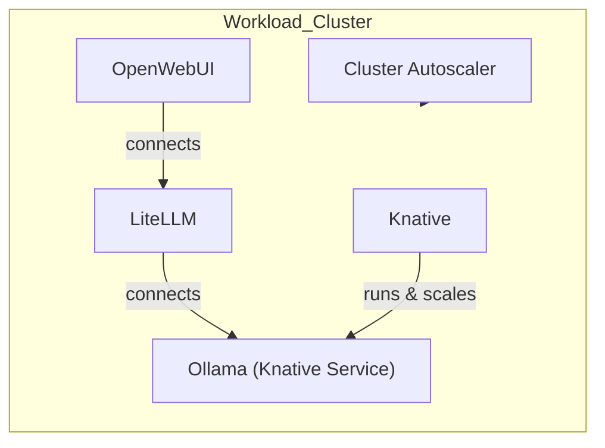
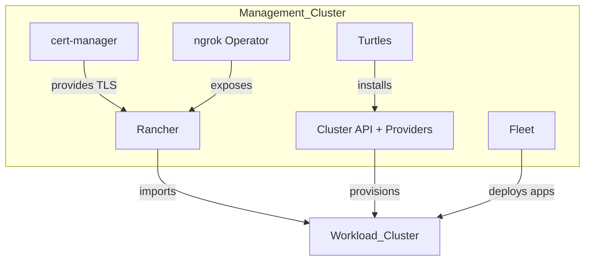
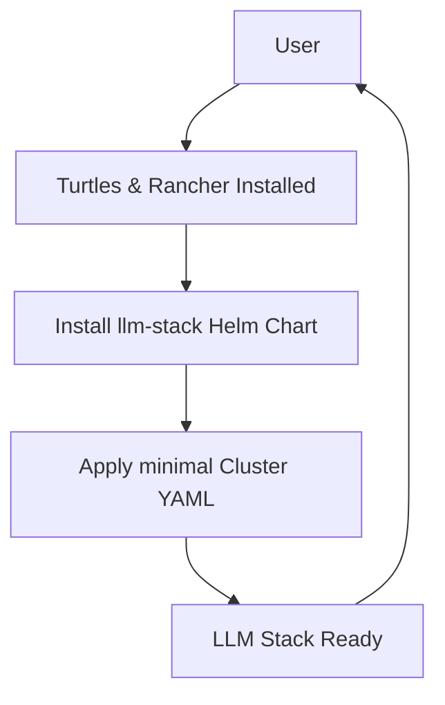

# Self-Scalable LLM Kubernetes Clusters 

## What and Why?

- Run private LLMs for privacy or to save money
- Combine public and local models: use your own for complex tasks (like DeepSeek for reasoning), and send less important requests to public APIs like OpenAI
- Have pods that run LLMs scale automatically within the cluster, and let the cluster itself scale up or down based on demand
- Automate the whole stack: from cluster lifecycle to running LLMs, on any infrastructure
- Use a prepared cluster configuration for your chosen infrastructure

## Prerequisites

Before getting started, ensure you have the following tools installed:

- **Docker** - Container runtime
- **kind** - Kubernetes in Docker for local clusters
- **kubectl** - Kubernetes CLI
- **helm** - Kubernetes package manager
- **ngrok account** - For exposing Rancher externally

### Required Environment Variables

Set these before running the deployment script:

```bash
export NGROK_API_KEY="your-ngrok-api-key"
export NGROK_AUTHTOKEN="your-ngrok-authtoken"
export RANCHER_HOSTNAME="your-ngrok-hostname.ngrok.io"
```

Optional variables (with defaults):
```bash
export RANCHER_VERSION="v2.13.0"
export CLUSTER_NAME="llm-rancher"
```

## How It Works

### 1. Workload Cluster

- **OpenWebUI**: A simple web interface for chatting with models
- **LiteLLM**: A gateway for LLMs that can send requests to different providers (Ollama, DeepSeek, OpenAI, etc.)
- **Ollama**: Lets you run private LLM models locally (deployed as Knative Service)
- **Knative + Kourier**: Handles serverless scaling for LLM services
- **Metrics Server**: Provides resource metrics for autoscaling
- **Local Path Storage**: Dynamic storage provisioning for the cluster
- **Calico CNI**: Container networking
- **Cluster Autoscaler**: Automatically adds or removes nodes based on demand



### 2. Management Cluster: Automation & GitOps

The management cluster (KIND) runs on your local machine and orchestrates everything:

- **Rancher**: Multi-cluster management UI and API (v2.13+ includes Turtles by default)
- **Rancher Turtles**: Integrates Cluster API with Rancher (built-in since Rancher 2.13)
- **Cluster API + Providers**: Provisions and manages workload clusters (Docker provider for local dev, v1.10.6)
- **Fleet**: GitOps-based application deployment to workload clusters
- **cert-manager**: TLS certificate management
- **ngrok Operator**: Exposes Rancher externally for cluster agent communication



### 3. Getting Started

The easiest way to get started is using the automated deployment script (see [Quick Start](#quick-start) below).

For manual setup or customization:

1. Set up a management cluster with Rancher and Turtles installed
2. Install the `llm-stack` Helm chart to create ClusterClass and Fleet bundles:
   ```bash
   helm install llm-stack ./llm-stack --set provider=docker
   ```
   Provider options:
   - `docker` - Installs ClusterClass + application bundles (for local dev)
   - `apps` - Installs application bundles only (for existing clusters)

3. Apply a cluster YAML that references the ClusterClass:
   ```yaml
   apiVersion: cluster.x-k8s.io/v1beta1
   kind: Cluster
   metadata:
     name: llm-workload
     labels:
       cni: calico
       cluster-api.cattle.io/rancher-auto-import: "true"
   spec:
     clusterNetwork:
       pods:
         cidrBlocks:
           - 192.168.0.0/16
       serviceDomain: cluster.local
       services:
         cidrBlocks:
           - 10.96.0.0/24
     topology:
       class: docker-llm-clusterclass
       controlPlane:
         replicas: 1
       version: v1.28.0
       workers:
         machineDeployments:
           - class: default-worker
             name: md-0
             metadata:
               annotations:
                 cluster.x-k8s.io/cluster-api-autoscaler-node-group-min-size: "1"
                 cluster.x-k8s.io/cluster-api-autoscaler-node-group-max-size: "3"
                 capacity.cluster-autoscaler.kubernetes.io/cpu: "2"
                 capacity.cluster-autoscaler.kubernetes.io/memory: "4Gi"
   ```
4. Cluster API and Fleet do the rest: provisioning, app deployment, and scaling.



## Quick Start

The deployment script automates the entire setup process:

```bash
# Set required environment variables
export NGROK_API_KEY="your-ngrok-api-key"
export NGROK_AUTHTOKEN="your-ngrok-authtoken"
export RANCHER_HOSTNAME="your-hostname.ngrok.io"

# Run the deployment
./deploy_infra.sh
```

The script will:
1. Create a KIND management cluster
2. Install cert-manager, ngrok operator, and Rancher
3. Install Rancher Turtles and Cluster API providers
4. Deploy the llm-stack Helm chart (ClusterClass + Fleet bundles)
5. Create the workload cluster via Cluster API
6. Wait for Rancher to import the cluster and deploy applications via Fleet

## Accessing Services

After deployment, use port forwarding to access the services:

```bash
./portforward.sh
```

This will expose:
- **Open WebUI**: http://localhost:8080 - Chat interface
- **LiteLLM**: http://localhost:4000 - LLM gateway API
- **Ollama**: http://localhost:11434 - Direct Ollama API

## Monitoring

### Check Fleet Bundle Status
```bash
kubectl get bundles -A
kubectl get bundledeployments -A
```

### Check Workload Cluster
```bash
KUBECONFIG=kubeconfig-llm-workload.yaml kubectl get nodes
KUBECONFIG=kubeconfig-llm-workload.yaml kubectl get pods -A
```

### Monitor Autoscaling
```bash
kubectl logs -f deployment/cluster-autoscaler
```

## Project Structure

```
├── deploy_infra.sh              # Main deployment script
├── portforward.sh               # Port forwarding helper
├── kubeconfig-llm-workload.yaml # Generated workload cluster kubeconfig
├── llm-stack/                   # Helm chart
│   ├── Chart.yaml
│   ├── values.yaml
│   └── templates/
│       ├── capi-clusterclass.yaml          # ClusterClass for Docker provider
│       ├── ollama-bundle.yaml              # Ollama Knative service
│       ├── litellm-bundle.yaml             # LiteLLM deployment
│       ├── litellm-config-bundle.yaml      # LiteLLM configuration
│       ├── openwebui-bundle.yaml           # Open WebUI deployment
│       ├── knative-*-bundle.yaml           # Knative components
│       ├── metrics-server-bundle.yaml      # Metrics server
│       └── local-path-storage-bundle.yaml  # Storage provisioner
└── manifests/
    └── infra/
        ├── capi-cluster.yaml               # Workload cluster definition
        ├── capi-providers.yaml             # CAPI provider configuration
        ├── cluster-autoscaler.yaml         # Autoscaler deployment
        ├── kind-cluster-with-extramounts.yaml
        └── rancher-patches.yaml
```

## Configuration

### LiteLLM Models

Edit `llm-stack/templates/litellm-config-bundle.yaml` to configure available models:

```yaml
model_list:
  - model_name: ollama/tinyllama
    litellm_params:
      model: ollama/tinyllama
      api_base: http://ollama.default.svc.cluster.local
  - model_name: openai/gpt-3.5-turbo
    litellm_params:
      model: gpt-3.5-turbo
      api_key: sk-xxx-your-openai-key-here
```

### Ollama Models

Edit `llm-stack/templates/ollama-startup-config-bundle.yaml` to change which models are pulled on startup. By default, it pulls `tinyllama`.

### Autoscaling

Worker node scaling is configured in the cluster YAML via annotations:
- `cluster-api-autoscaler-node-group-min-size`: Minimum nodes (default: 1)
- `cluster-api-autoscaler-node-group-max-size`: Maximum nodes (default: 3)

Ollama pod scaling is handled by Knative, configured in `ollama-bundle.yaml`:
- `autoscaling.knative.dev/min-scale`: Minimum pods
- `autoscaling.knative.dev/max-scale`: Maximum pods
- `autoscaling.knative.dev/target`: Concurrent requests per pod
